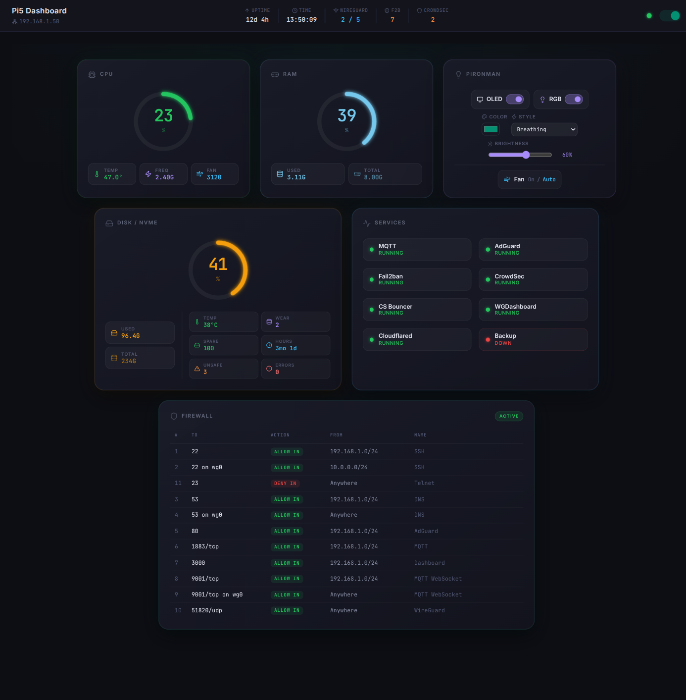
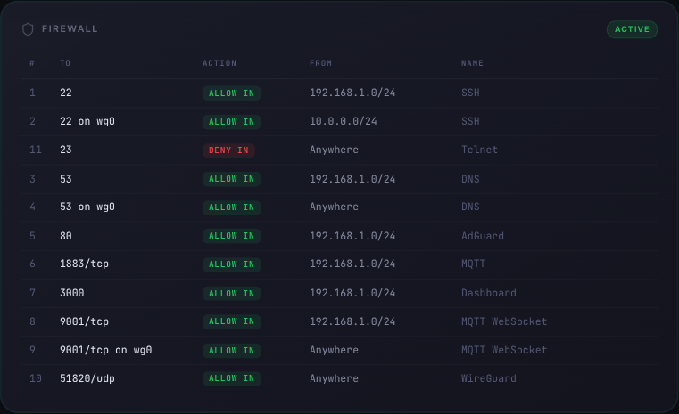
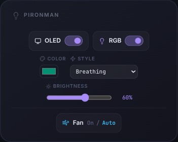

# Pi5 Dashboard

A small web dashboard for a Raspberry Pi 5 in a Pironman5 case. It subscribes to MQTT, shows what the Pi is doing, and lets you drive the case hardware from the browser.

It's the front end for [Pi5_MQTT](https://github.com/Alex93IDE/Pi5_MQTT), the daemon that actually reads the machine and publishes it. This repo only listens and renders — it never touches the Pi directly, so everything it shows is whatever the publisher decided to send.



## What you get

Everything arrives over MQTT and updates on its own as messages come in — no polling, no refresh button.

A bar across the top carries the things you want to see without opening anything: local IP, uptime, last message time, VPN peers, and the Fail2ban and CrowdSec ban counters, which go amber the moment they're non-zero. The dot on the right is the broker connection, and the switch beside it disconnects and reconnects without reloading the page.

Below it, a menu splits the rest into five tabs.

### Home

The overview, as four cards and an **Alerts** card underneath:

- **CPU** — overall load, a bar per core, load average over 1, 5 and 15 minutes, frequency, temperature and fan speed. The load average turns amber and red relative to the number of cores, since 4.0 on a four-core Pi means every core is busy.
- **RAM** — used and total, plus a graph of the last minute.
- **Disk / NVMe** — disk usage and the drive's health straight from SMART: temperature, spare capacity, wear, power-on hours, unsafe shutdowns and media errors.
- **Network** — download and upload speed on the active interface, plus a graph of the last minute.

Both graphs scale to what happened in that minute rather than to a fixed range, so small changes are visible: the labels on the left say what the top and bottom of the graph mean. They live in memory, so they start again when you reload the page.

The cards sit four in a row on a wide screen, two by two on a laptop or tablet, and one under the other on a phone — never three and one. Alerts spans the same width as the cards above it.

Alerts is the one to glance at. It collects everything that needs attention in one place, errors in red at the top, warnings in amber below, and a green check when there's nothing to report. Most entries are links to the tab where you can look closer. The browser tab follows along too — the title becomes `(3) Pi5 Dashboard` and the icon gets a red or amber dot — so you notice from another tab.

| | error | warning |
|---|---|---|
| Connection | broker disconnected, or the Pi reports itself offline | no metrics from the publisher for 15 s |
| systemd | any unit `failed`, or a starred one that isn't `active` | — |
| Docker | `dead`, `restarting`, or a starred one that isn't running | any other container that isn't running |
| Firewall | UFW not `active` | — |
| Hardware | NVMe media errors, NVMe spare ≤ 10 % | CPU ≥ 80 °C, RAM ≥ 90 %, disk ≥ 90 %, NVMe ≥ 70 °C, NVMe wear ≥ 90 % |

An `inactive` systemd unit doesn't raise anything on its own. A typical Pi has a couple of hundred units and most of them are supposed to be inactive — oneshots that already ran, services for hardware you don't have. If you care whether one in particular is up, star it.

### When the Pi goes away

The publisher announces itself on a status topic and leaves `offline` behind as its last will, so the broker tells the dashboard the moment the Pi drops off — power cut, crash, network gone. When that happens a red bar says so, every card is greyed out, and Alerts shows only that: the numbers on screen are retained from before the Pi went away, and judging them would just produce stale alerts.

### Services and Docker

Every systemd unit and every Docker container the publisher reports, in alphabetical order, with a search box and a few filters (all, active or running, failed or stopped, favorites). The counter in the corner is how many are up out of the total.

Each systemd row also shows its unit file state — `enabled`, `static`, `disabled`, `masked` — as a small grey tag. That's for information only; it never makes anything red. A oneshot that is `active` / `exited` shows green, because that's a unit that ran and finished fine.

The star marks a favorite. Favorites are stored by the publisher, not in your browser, so they follow you from the laptop to the phone. They're what the Alerts card watches most closely.

### UFW



`ufw status numbered` puts the rule comment inline, in the middle of the source column — `192.168.1.0/24 # SSH`. The table splits it back out, so the source and the label each get a column and the `#` disappears. Rules are sorted by port rather than by rule number, which is how you actually read a firewall: everything on port 53 sits together regardless of the order it was added.

### Pironman



Case controls, relayed to the hardware by the daemon: OLED on and off, RGB on and off, colour, animation style, brightness, and the fan between always-on and auto.

### On a phone or tablet

The layout adapts down to phone width: the top bar splits into two rows, the firewall table scrolls sideways inside its card, and the lists put each unit's status on a second line.

You can also swipe left and right on the page to move between tabs, in menu order. It only counts as a swipe if it's quick and clearly sideways, so scrolling down a long list won't change page, and it's ignored when it starts on something that moves sideways on its own — a slider, the colour picker, or the firewall table on a phone.

### Install it as an app

It's a PWA: on a phone, tablet or desktop browser you can install it ("Add to home screen", or the install icon in the address bar) and it opens in its own window with its own icon, no browser bars. Only the app itself is stored on the device; the data still comes live from the broker.

When you deploy a new version, an open copy notices within 15 minutes, or as soon as you switch back to it, and shows a **New version available** banner. Tap **Update** and it reloads onto the new one. It never switches by itself in the middle of what you're doing.

Browsers only allow this over **HTTPS** (or on `localhost`). Served as plain `http://192.168.x.x`, the dashboard works exactly the same but can't be installed and won't cache itself. See the security notes for why HTTPS also means `wss` for the broker.

### Nothing is optimistic

Every control — the Pironman switches and the favorite stars alike — sends its command and then waits for the publisher to report the new state before it moves. A star pulses while it waits. If a command doesn't land, the control stays where it was instead of lying to you.

## Requirements

- Node 20 or newer, to build it.
- A broker with a **WebSocket listener** — browsers can't speak raw MQTT on 1883. For Mosquitto that's two lines in `mosquitto.conf`:

  ```
  listener 9001
  protocol websockets
  ```

- [Pi5_MQTT](https://github.com/Alex93IDE/Pi5_MQTT) running on the Pi. An older publisher still works, you just lose the parts it doesn't send: without `pi5/services` and `pi5/docker` those tabs sit on "Waiting for data…", without `pi5/status` the dashboard can't tell when the Pi goes offline, and without the per-core and network fields the CPU bars and the Network card show dashes.

## Getting it running

```bash
git clone https://github.com/Alex93IDE/Pi5_Dashboard.git
cd Pi5_Dashboard
npm install
cp .env.example .env
```

Point `.env` at your broker, then:

```bash
npm run dev
```

To build it for good:

```bash
npm run build
```

That leaves a static bundle in `dist/` — any web server will do, including the Pi itself. There's also an rsync shortcut if you deploy over SSH: set `DEPLOY_TARGET` in your `.env` (`user@host:/path` of the directory nginx serves), then run:

```bash
npm run deploy
```

Each tab has its own address (`/services`, `/ufw`…), so the web server has to hand `index.html` back for paths it doesn't know. Otherwise reloading any tab but Home gives you a 404. In nginx:

```nginx
location / {
    try_files $uri $uri/ /index.html;
}
```

After deploying, installed copies pick the new version up through the update banner described above.

The footer shows when the bundle was built, as a single number like `202610041530` — handy for checking that the phone isn't showing you a cached copy of last week's deploy.

## Configuration

Everything lives in `.env` and is read at build time, not runtime — rebuild after changing it.

| variable | default | |
|---|---|---|
| `VITE_MQTT_PROTOCOL` | `ws` | `ws`, or `wss` if the page is served over HTTPS |
| `VITE_MQTT_HOST` | `localhost` | broker host |
| `VITE_MQTT_PORT` | `9001` | broker WebSocket port |
| `VITE_MQTT_USER` | — | MQTT username |
| `VITE_MQTT_PASS` | — | MQTT password |
| `VITE_TOPIC_FAST` | `pi5/fast` | metrics, once a second |
| `VITE_TOPIC_SLOW` | `pi5/slow` | NVMe, bans and firewall, every 30 s |
| `VITE_TOPIC_STATUS` | `pi5/status` | `online` / `offline` (retained, last will) |
| `VITE_TOPIC_SERVICES` | `pi5/services` | systemd units, every 30 s |
| `VITE_TOPIC_DOCKER` | `pi5/docker` | Docker containers, every 30 s |
| `VITE_TOPIC_CTRL` | `pi5/control/pironman` | case commands |
| `VITE_TOPIC_CTRL_SERVICES` | `pi5/control/services` | favorite commands |

The topics have to match the publisher's. If you never changed them there, leave them alone here too.

### Broker permissions

Give the dashboard its own broker user that can read the status topics, write the two control topics, and do nothing else. In Mosquitto that's an entry in the file your `acl_file` points to:

```
user <dashboard_user>
topic read  pi5/fast
topic read  pi5/slow
topic read  pi5/status
topic read  pi5/services
topic read  pi5/docker
topic write pi5/control/pironman
topic write pi5/control/services
```

The publisher's own user needs `topic write pi5/status` on top of what it already had.

Restart Mosquitto after editing it. A topic missing from the list fails silently — the subscription is accepted and simply never delivers anything — so if a tab stays empty, this is the first place to look.

### Upgrading from an older version

Service status used to ride along in `pi5/slow` as `svc_*` fields, renamed through `VITE_SERVICE_LABELS`. Both are gone: services now come complete on their own topic, with systemd's description as the label.

To upgrade, update the publisher first, then:

1. add `VITE_TOPIC_STATUS`, `VITE_TOPIC_SERVICES`, `VITE_TOPIC_DOCKER` and `VITE_TOPIC_CTRL_SERVICES` to `.env` if you use non-default topics, and delete `VITE_SERVICE_LABELS`;
2. add the new topics to the broker ACL, as above;
3. rebuild and deploy.

## Security notes

Worth reading before you host this anywhere.

**The credentials end up in the bundle.** Vite inlines `VITE_*` variables at build time, so anyone who can load the page can read the broker username and password out of the JavaScript. That's true of every browser MQTT client, not something this project does wrong, but it does mean the page belongs on your LAN or behind your VPN and not on the open internet. The ACL above is what limits the damage: with it, someone holding those credentials can read your metrics and flip your favorites or your case LEDs, and nothing more.

**What's on screen is a map of your machine.** Local IP, open ports, firewall sources, every service and container you run. Useful to you, useful to anyone else too.

**Use `wss` if the page is served over HTTPS.** Browsers block plain `ws://` from an HTTPS origin, and it's unencrypted either way — over `ws`, your broker password crosses the network in the clear.

**There's no auth layer here, by design.** The dashboard assumes it's sitting somewhere already private.

## Layout

```
src/
  config.ts               reads .env — broker and topics
  pwa.ts                  service worker registration and the update banner's logic
  composables/
    mqtt.ts               connection, subscriptions, publishing
    alerts.ts             the rules behind the Alerts card and tab title
  stores/mqtt.ts          the payload shapes and where they live
  router/                 one route per tab
  layouts/                top bar, tab menu, swipe between tabs
  views/                  Home, Services, UFW, Docker, Pironman
  utils/
    units.ts              systemd/Docker state → colour, rows for the lists
    number.ts             turns smartctl's "3,234" or "100%" into numbers
  components/
    CpuCard.vue           load, per-core bars, load average, frequency, temperature, fan
    RamCard.vue           memory and a one-minute graph
    DiskNetCard.vue       disk usage and NVMe health
    NetworkCard.vue       throughput and a one-minute graph
    Sparkline.vue         the small last-minute graph used by RAM and Network
    AlertsCard.vue        everything that needs attention
    UnitList.vue          searchable list with stars, used by Services and Docker
    UfwCard.vue           firewall rules
    PironmanControl.vue   case controls
    UpdateBanner.vue      "New version available" prompt
```

Vue 3 with `<script setup>`, TypeScript, Pinia, Vue Router, Vite, [vite-plugin-pwa](https://vite-pwa-org.netlify.app) for the installable app, and [lucide](https://lucide.dev) for icons. Styling is plain CSS with custom properties in `src/style.css` — change the palette there and the whole thing follows.

The screenshots were taken with mock data, so the addresses, rules and services in them are made up.

## License

MIT — see [LICENSE](LICENSE). Do what you like with it.
